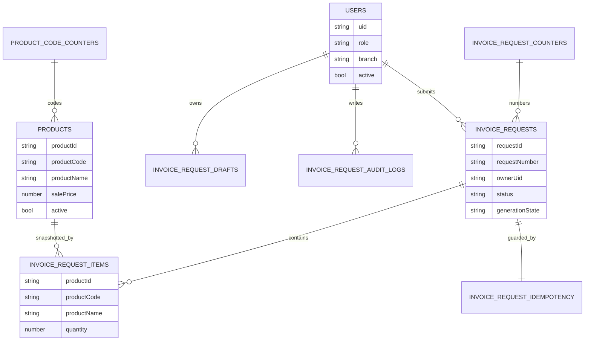

# Database Relationship Diagram

```mermaid
erDiagram
  USERS ||--o{ INVOICE_REQUESTS : submits
  USERS ||--o{ INVOICE_REQUEST_DRAFTS : owns
  USERS ||--o{ INVOICE_REQUEST_AUDIT_LOGS : writes
  PRODUCTS ||--o{ INVOICE_REQUEST_ITEMS : snapshotted_by
  INVOICE_REQUESTS ||--o{ INVOICE_REQUEST_ITEMS : contains
  INVOICE_REQUESTS ||--|| INVOICE_REQUEST_IDEMPOTENCY : guarded_by
  INVOICE_REQUEST_COUNTERS ||--o{ INVOICE_REQUESTS : numbers
  PRODUCT_CODE_COUNTERS ||--o{ PRODUCTS : codes

  USERS {
    string uid
    string role
    string branch
    bool active
  }
  PRODUCTS {
    string productId
    string productCode
    string productName
    number salePrice
    bool active
  }
  INVOICE_REQUESTS {
    string requestId
    string requestNumber
    string ownerUid
    string status
    string generationState
  }
  INVOICE_REQUEST_ITEMS {
    string productId
    string productCode
    string productName
    number quantity
  }
```

Invoice request items are snapshots. They should not depend on future product edits for historical correctness.
